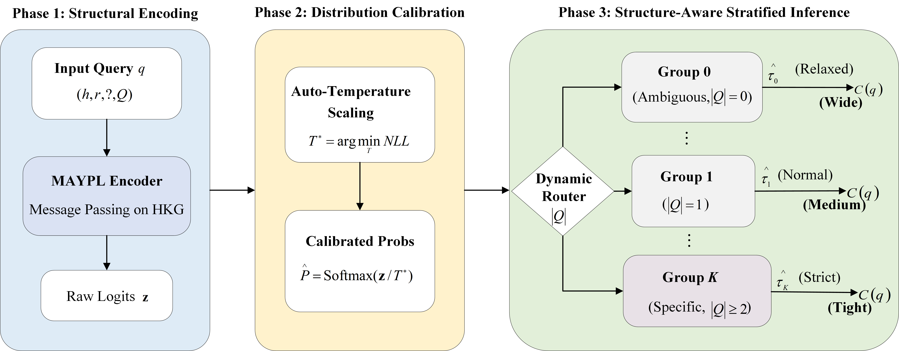

# ReliableHKG

ReliableHKG, a structure-aware conformal reasoning framework that transforms deterministic embeddings into valid prediction sets with strict statistical coverage guarantees. 
By integrating auto-temperature scaling with a novel Stratified Adaptive Prediction Sets (APS) mechanism, our framework dynamically routes queries based on their qualifier density to independently learn group-specific conformal thresholds. 

# Model Architecture

 Schematic illustration of the proposed ReliableHKG model

# Requirements

To run the codes (Python>=3.8), you need to install the requirements:
'''
charset-normalizer 2.1.1
colorama           0.4.6
filelock           3.19.1
fsspec             2025.10.0
idna               3.4
Jinja2             3.1.6
MarkupSafe         2.1.5
mpmath             1.3.0
networkx           3.2.1
numpy              1.26.4
pillow             11.3.0
pip                25.3
requests           2.28.1
setuptools         80.9.0
sympy              1.14.0
torch              2.1.0+cu121
torchaudio         2.1.0+cu121
torchvision        0.16.0+cu121
tqdm               4.67.1
typing_extensions  4.15.0
urllib3            1.26.13
wheel              0.45.1
'''

# Data Preprocess

  You can download the data of WK/NL/FB-25/50/75/100 from [HyRel](https://github.com/hncps6/HyRel)and [MAYPL](https://github.com/bdi-lab/MAYPL/) repositories.

# Acknowledgement

Thanks to the following people for their work.

Yongfang Li: Conceptualization, Methodology, Investigation, Software, Validation, Writing - original draft; 
Chunhua Zhu: Funding Acquisition, Writing–review, Supervision; 
Yuhong Zhang: Funding Acquisition, Writing - review & editing, Formal analysis;
Meng Zhao: Review & editing; 
Zhihua Liu: Software, Validation.